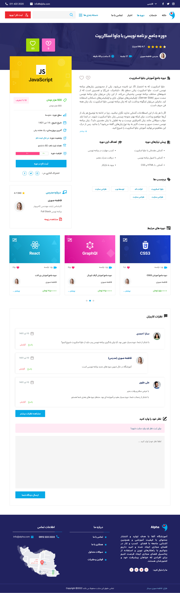

# UI Design with Figma

  <table>
  <tr  style="padding: 10; border=0;">
    <td valign="top"></td>
    <td valign="top"></td>
  </tr>
  <tr>
    <td valign="top"></td>
    <td valign="top"></td>
  </tr>
  <tr>
      <td valign="top"></td>
      <td valign="top"></td>
  </tr>
 </table>

